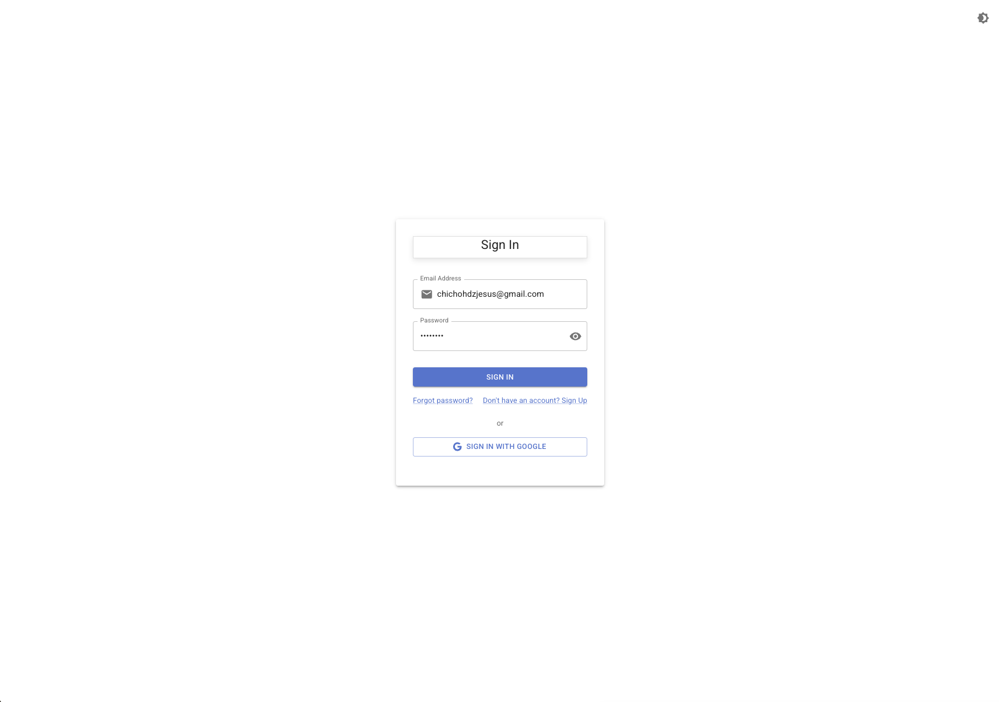
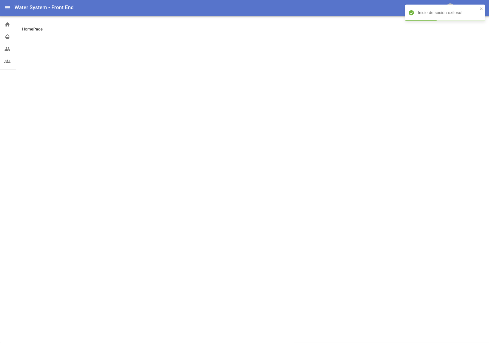
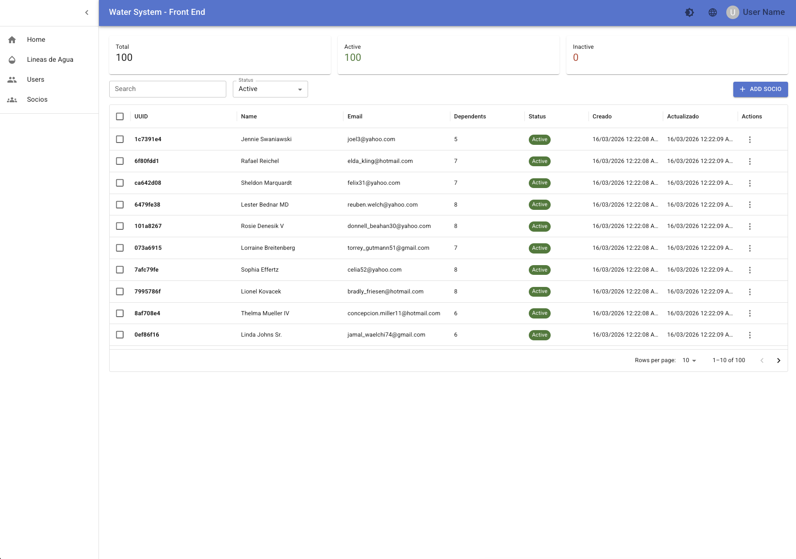
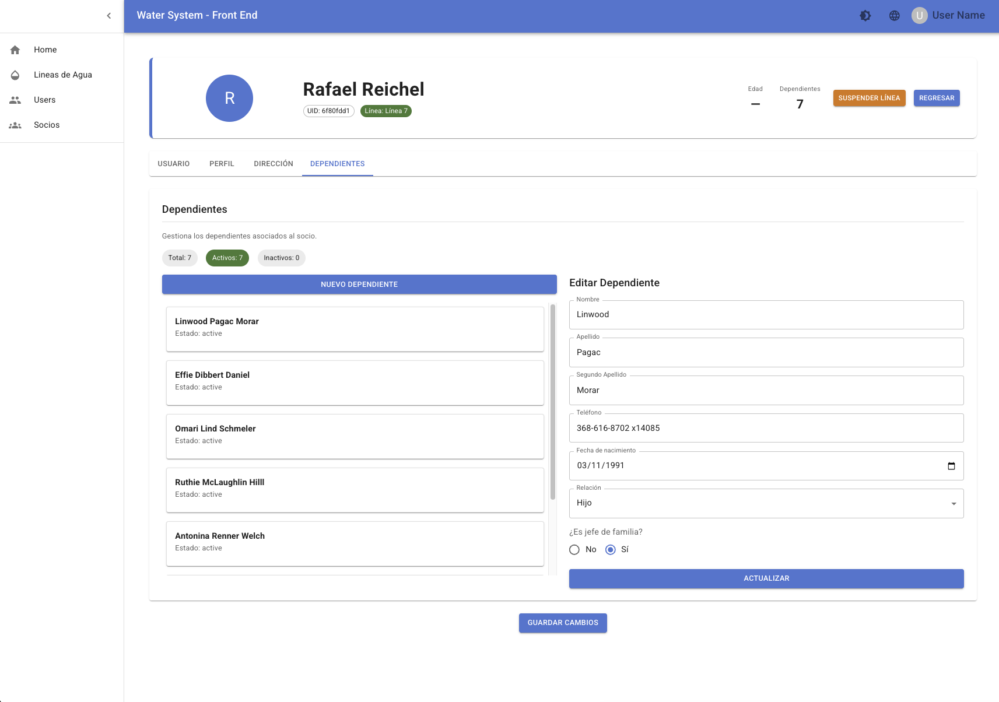
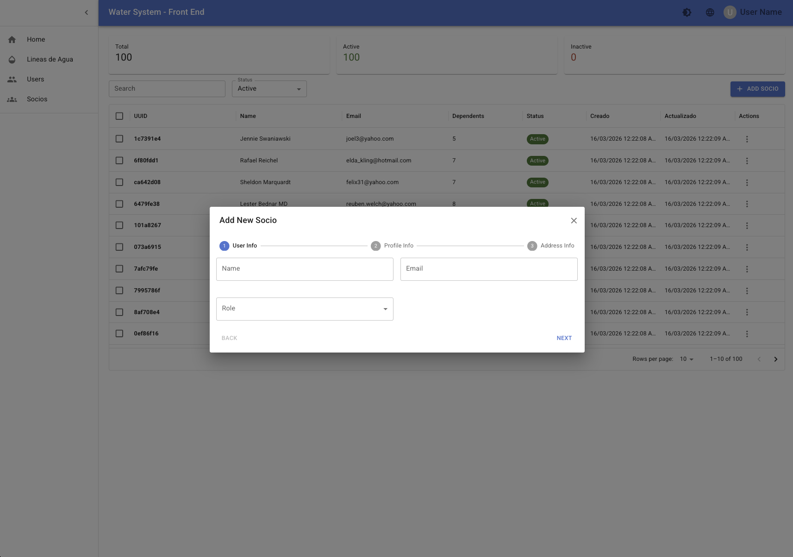
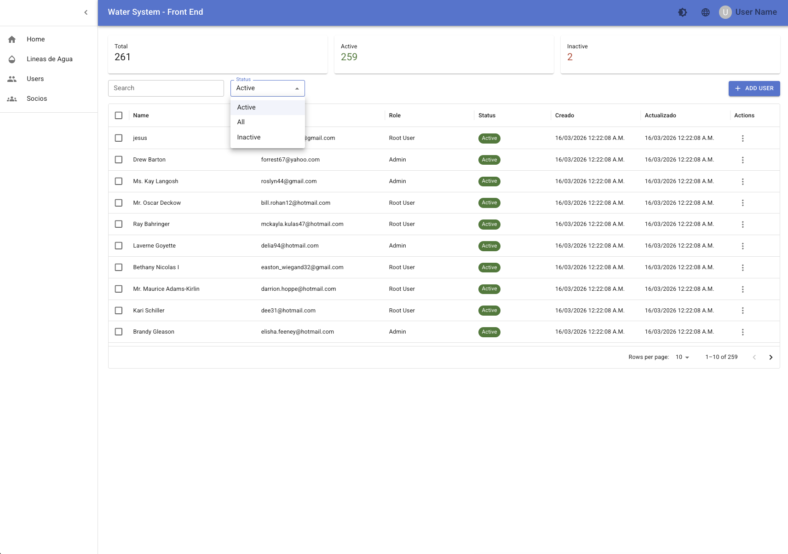
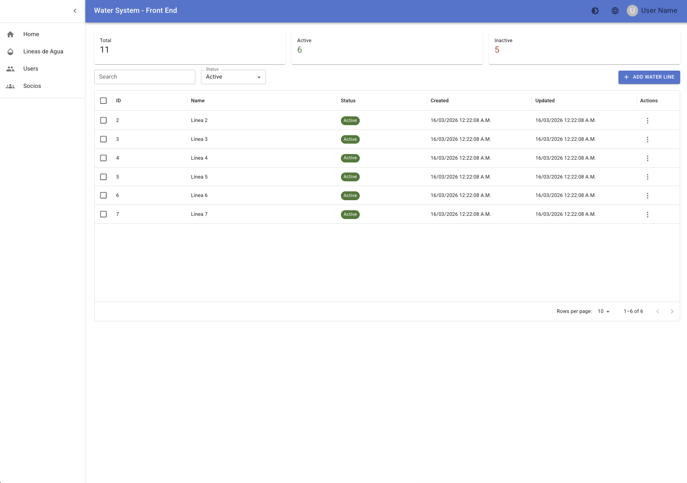
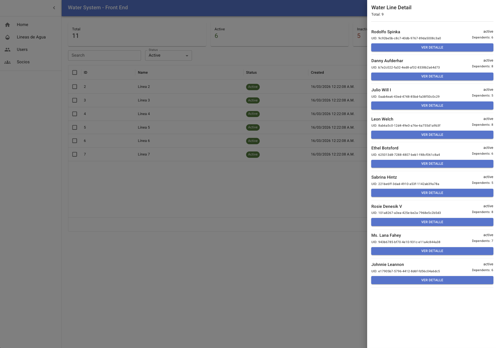
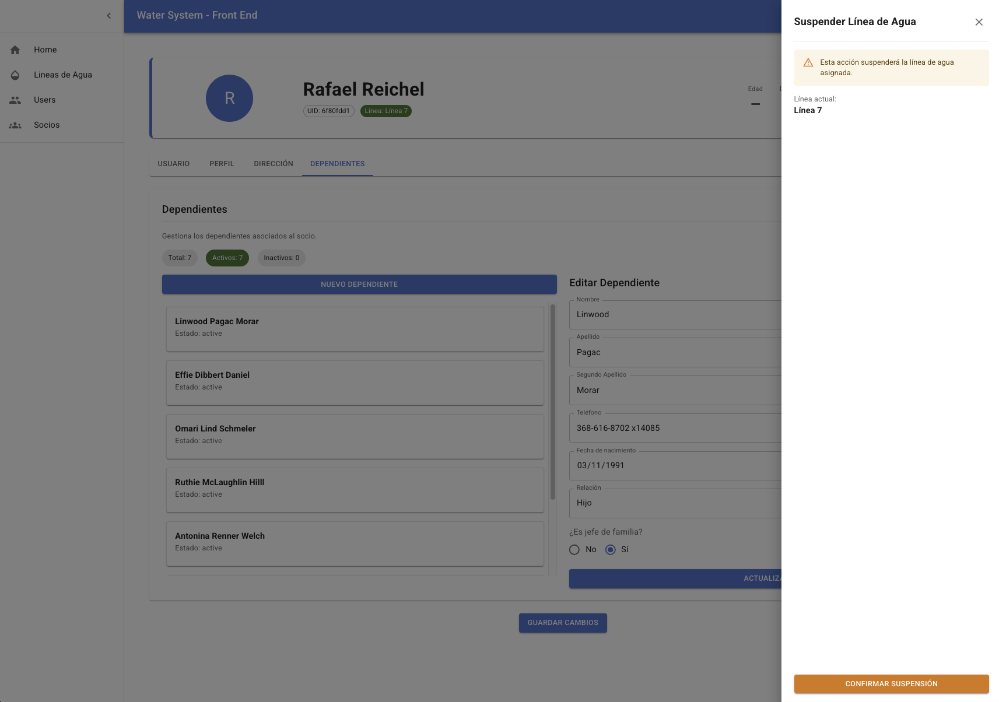

# water-system-front-end

## Desarrollado por: Jesus Chicho Hernández

Este proyecto es el frontend del sistema **Water System Back (Proyecto de portafolio)**, desarrollado en **React**, diseñado para consumir una API backend construida en Node.js. El objetivo del proyecto es ofrecer una interfaz clara, modular y mantenible para la gestión del sistema, priorizando una correcta integración frontend–backend.


## Vista previa

### Login


### Dashboard / Home


### Gestión de socios


### Detalle de socio


### Alta de socio


### Gestión de usuarios


### Líneas de agua


### Detalle línea de agua


### Desactivación de línea



## ¿Qué resuelve este proyecto?

Permite gestionar socios, dependientes y líneas de agua, centralizando la información y facilitando operaciones administrativas mediante formularios estructurados, validaciones robustas y flujos claros de usuario.


## Highlights técnicos

- Arquitectura modular basada en dominios (auth, socio, dashboard)
- Separación clara de responsabilidades: UI / hooks / services / mappers
- Formularios complejos con Formik + Yup (validación escalable)
- Consumo desacoplado de API mediante Axios
- Soporte para mock data configurable por variables de entorno
- Manejo de estado y side-effects controlado
- Estructura preparada para escalar (Clean-ish architecture)


### Habilidades y Características:

- **Arquitectura Frontend**:
  - Estructura modular de componentes enfocada en reutilización y mantenibilidad.
  - Separación de responsabilidades entre vistas, lógica y servicios.

- **Consumo de API REST**:
  - Integración con servicios backend mediante peticiones HTTP.
  - Manejo estructurado de datos provenientes de la API.

- **Gestión de Estado y Lógica de UI**:
  - Manejo de estado para flujos comunes de la aplicación.
  - Control de formularios y validaciones básicas.

- **Buenas Prácticas de Desarrollo**:
  - Código limpio y legible.
  - Organización del proyecto orientada a escalabilidad y refactorización futura.

- **Integración Frontend–Backend**:
  - Enfoque en comunicación eficiente con la API para flujos como autenticación y gestión de usuarios.

### Tecnologías utilizadas:

- React
- TypeScript
- Vite
- MUI (Material UI)
- Formik
- Yup
- Axios

## Estructura principal del repo

```text
├── public
├── scripts
└── src
    ├── assets
    ├── interfaces
    │   ├── auth
    │   ├── shared
    │   └── user
    ├── modules
    │   ├── auth
    │   │   ├── components
    │   │   ├── pages
    │   │   ├── routes
    │   │   └── services
    │   ├── dashboard
    │   └── private
    │       ├── socio
    │       │   ├── components
    │       │   │   ├── dependents
    │       │   │   ├── form-sections
    │       │   │   └── water-line
    │       │   ├── hooks
    │       │   ├── interfaces
    │       │   ├── mappers
    │       │   ├── mockData
    │       │   ├── pages
    │       │   └── services
    ├── redux
    ├── shared
    │   ├── components
    │   └── services
    ├── test
    └── utils
```

### Instrucciones de inicio:

1. **Requisitos previos:**
   - Tener Node.js y Yarn instalados.

2. **Configuración del proyecto:**
   ```bash
   # Clona el repositorio
   git clone https://github.com/JesusLBS/water-system-front-end.git
   cd water-system-front-end

   # Instala las dependencias
   yarn install

   # copiar .env.example a .env y rellenar

   cp .env.example .env
   # editar .env con la URL del backend y claves
   ```

    Variables importantes en `.env` (ejemplo):

    ```
    VITE_APP_API_URL=https://api.example.com/
    VITE_USE_MOCK=true
    ```

    ---

    ## Scripts útiles

    * `yarn dev` — modo desarrollo (Vite)
    * `yarn build` — build de producción
    * `yarn preview` — preview del build
    * `yarn lint` — eslint
    * `yarn manage:module` — script interno para crear módulos
    ---
    ## Cómo ejecutar con backend local

    1. Levante el backend (`water-system-back`) siguiendo su README.
    2. En el frontend, apunta `VITE_APP_API_URL` a la URL local del backend (ej. `http://localhost:3000/`).
    3. `yarn dev` para iniciar el frontend.

    ---
### Documentación técnica

El proyecto contempla documentación sobre estructura, decisiones técnicas y posibles refactors
relacionados con la integración frontend–backend.

**Skills demostradas en este repo:**

* Frontend: React, TypeScript, Vite, MUI, Formik, Yup — diseño de formularios, validación, patrones reutilizables (wrappers Formik).
* Arquitectura: organización modular por dominios, uso de hooks personalizados, Clean-ish architecture en capas (services, repositories, mappers).
* Integración: consumo de APIs REST con Axios, manejo de estados y side-effects.
* Testing & tooling: Vitest, ESLint, Husky, commitlint.

### Licencia

Este proyecto no está licenciado para uso público. Todos los derechos reservados. Para obtener permisos de uso, contacta al propietario del proyecto en chichohdzjesus@gmail.com.

Consulta la licencia completa en [NOTICE.txt](./NOTICE.txt).
